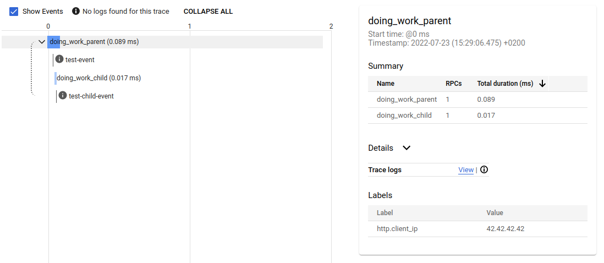

[](https://crates.io/crates/opentelemetry-gcloud-trace)


# OpenTelemetry support for Google Cloud Trace

## Quick start

Cargo.toml:
```toml
[dependencies]
opentelemetry-gcloud-trace = "0.12"
```

## Compatibility matrix

| opentelemetry-gcloud-trace version | opentelemetry version | tracing-opentelemetry | gcloud-sdk |
|------------------------------------|-----------------------|-----------------------|------------|
| 0.12                               | 0.24                  | 0.25                  | 0.25       |
| 0.11                               | 0.23                  | 0.24                  | 0.25       |
| 0.10                               | 0.23                  | 0.24                  | 0.24       |

Example:

```rust

use opentelemetry::trace::*;
use opentelemetry_gcloud_trace::*;

let tracer = GcpCloudTraceExporterBuilder::for_default_project_id().await? // or GcpCloudTraceExporterBuilder::new(config_env_var("PROJECT_ID")?)
    .install()
    .await?;

tracer.in_span("doing_work_parent", |cx| {
  // ...
});

```

All examples are available at [examples](examples) directory.

To run an example use with environment variables:
```
# PROJECT_ID=<your-google-project-id> cargo run --example enable-exporter
```




```toml
[dependencies]
opentelemetry = { version = "*", features = [] }
opentelemetry_sdk = { version = "*", features = ["rt-tokio"] }
opentelemetry-gcloud-trace = "*"
```


## Configuration

You can specify trace configuration using `with_trace_config`:

```rust
   GcpCloudTraceExporterBuilder::new(google_project_id).with_trace_config(
      trace::config()
         .with_sampler(Sampler::AlwaysOn)
         .with_id_generator(RandomIdGenerator::default())
   )
```

## Limitations
- This exporter doesn't support any other runtimes except Tokio.

## Integration with logs
This crate intentionally doesn't export logs using API to avoid duplicate logs on GKE/GCE environments. 
You can use this crate in combination with `tracing-stackdriver` crate to produce 
JSON formatted logs and logs and traces will be correlated by `trace_id` and `span_id` 
fields automatically. 
 
This is an example of this kind of configuration:
```rust

fn init_console_log(
    tracer: opentelemetry_sdk::trace::Tracer,
) -> Result<(), Box<dyn std::error::Error + Send + Sync>> {
    let telemetry = tracing_opentelemetry::layer().with_tracer(tracer);

    let subscriber = tracing_subscriber::registry::Registry::default()
        .with(tracing_subscriber::fmt::layer())
        .with(tracing_subscriber::EnvFilter::from_str(
            "gcloud_sdk=debug",
        )?)
        .with(telemetry);

    tracing::subscriber::set_global_default(subscriber)?;

    Ok(())
}

fn init_stackdriver_log(
    gcp_project_id: &str,
    tracer: opentelemetry_sdk::trace::Tracer,
) -> Result<(), BoxedError> {
    let telemetry_layer = tracing_opentelemetry::layer().with_tracer(tracer);

    let stackdriver_layer = tracing_stackdriver::layer().with_cloud_trace(
        tracing_stackdriver::CloudTraceConfiguration {
            project_id: gcp_project_id.to_string(),
        },
    );

    let subscriber = tracing_subscriber::Registry::default()
        .with(telemetry_layer)
        .with(stackdriver_layer)
        .with(tracing_subscriber::EnvFilter::from_str(
            "gcloud_sdk=debug",
        )?);
    tracing::subscriber::set_global_default(subscriber)
        .expect("Could not set up global logger");

    Ok(())
}

async fn init_tracing(app_mode: &GlobalAppMode, 
                      gcp_project_id: &str) -> Result<(), BoxedError> {
    let tracer = GcpCloudTraceExporterBuilder::new(gcp_project_id.into())
        .install()
        .await?;

    match app_mode {
        GlobalAppMode::Production => init_stackdriver_log(gcp_project_id, tracer),
        GlobalAppMode::Development => init_console_log(tracer),
    }
}

```

## TLS related features
Cargo provides support for different TLS features for dependencies:
- `tls-roots`: default feature to support native TLS roots
- `tls-webpki-roots`: feature to switch to webpki crate roots

## Licence
Apache Software License (ASL)

## Author
Abdulla Abdurakhmanov
