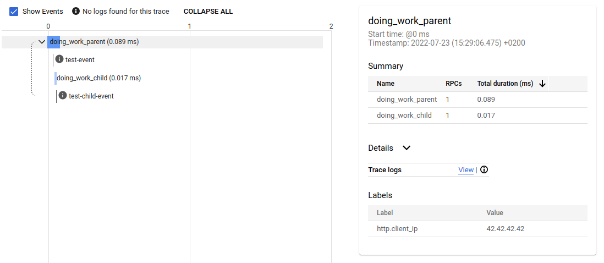

[](https://crates.io/crates/opentelemetry-gcloud-trace)


# OpenTelemetry support for Google Cloud Trace and Google Cloud Logging

## Quick start

Cargo.toml:
```toml
[dependencies]
opentelemetry-gcloud-trace = "0.27"
```

### Crypto provider error

Depends on your other dependencies you may see the error like:

```
no process-level CryptoProvider available -- call CryptoProvider::install_default() before this point 
```

This is because the TLS providers are not installed by default and you can choose different.
The easiest way to fix is just to include one of the provider, for example:

```toml
[dependencies]
rustls = "0.23"
```

If you have multiple you may need to call `CryptoProvider::install_default()` before using the Firestore client.

```rust
rustls::crypto::ring::default_provider().install_default().expect("Failed to install rustls crypto provider");
```

## Compatibility matrix

| opentelemetry-gcloud-trace version | opentelemetry version | tracing-opentelemetry | gcloud-sdk |
|------------------------------------|-----------------------|-----------------------|------------|
| 0.27                               | 0.32                  | 0.33                  | 0.32       |
| 0.26                               | 0.32                  | 0.33                  | 0.32       |
| 0.25                               | 0.32                  | 0.33                  | 0.31       |
| 0.24                               | 0.32                  | 0.33                  | 0.30       |
| 0.23                               | 0.31                  | 0.32                  | 0.29       |
| 0.22                               | 0.31                  | 0.32                  | 0.28       |


Example:

```rust

let gcp_trace_exporter = GcpCloudTraceExporterBuilder::for_default_project_id().await?; // or GcpCloudTraceExporterBuilder::new(config_env_var("PROJECT_ID")?)

let tracer_provider = gcp_trace_exporter.create_provider().await?;
let tracer: opentelemetry_sdk::trace::Tracer = gcp_trace_exporter.install(&tracer_provider).await?;

opentelemetry::global::set_tracer_provider(tracer_provider.clone());

tracer.in_span("doing_work_parent", |cx| {
  // ...
});

tracer_provider.shutdown()?;


```

All examples are available at [examples](examples) directory.

To run an example use with environment variables:
```
# PROJECT_ID=<your-google-project-id> cargo run --example enable-exporter
```




```toml
[dependencies]
opentelemetry = { version = "*", features = [] }
opentelemetry_sdk = { version = "*", features = ["rt-tokio"] }
opentelemetry-gcloud-trace = "*"
```

## Configuration

You can specify trace configuration using `with_tracer_provider_builder`:

```rust
   let exporter = GcpCloudTraceExporterBuilder::new(google_project_id);
   let provider = exporter.create_provider_from_builder ( TracerProvider::builder()
         .with_sampler(Sampler::AlwaysOn)
         .with_id_generator(RandomIdGenerator::default())
   ));
```

## Limitations
- This exporter doesn't support any other runtimes except Tokio.

## Integration with logs

Cloud Trace and Cloud Logging are separate products, and this crate now
provides a `tracing_subscriber` layer for the latter alongside the trace
exporter. Earlier versions pointed users at a separate third-party crate for
JSON logs correlated to a trace; that crate read `tracing-opentelemetry`'s
private span extension to find `trace_id`/`span_id`, broke silently whenever
that extension's shape changed, and — combined with this exporter — reported
every event twice, once as a Cloud Trace annotation (`tracing-opentelemetry`
turns each event into a span event) and once as a log line.
`GcpCloudLoggingLayer` correlates through `tracing-opentelemetry`'s public
context API instead, and span events are no longer exported as Cloud Trace
annotations by default (see below), so a log line is the only place a message
is written. See "Migrating from `tracing-stackdriver`" below if you already
use that crate.

A layer uses exactly one sink, chosen when it is built.

### JSON lines (default, feature `logs`)

For GKE, Cloud Run, or a GCE instance with the Cloud Logging agent installed:
the agent already parses structured JSON written to stdout, so the layer only
needs to serialise each event.

```rust
use opentelemetry_gcloud_trace::logs::GcpCloudLoggingLayerBuilder;
use opentelemetry_gcloud_trace::GcpCloudTraceExporterBuilder;
use tracing_subscriber::layer::SubscriberExt;
use tracing_subscriber::{EnvFilter, Registry};

#[tokio::main]
async fn main() -> Result<(), Box<dyn std::error::Error + Send + Sync>> {
    let project_id = "my-gcp-project-id".to_string();

    let gcp_trace_exporter = GcpCloudTraceExporterBuilder::new(project_id.clone());
    let tracer_provider = gcp_trace_exporter.create_provider().await?;
    let tracer = gcp_trace_exporter.install(&tracer_provider).await?;
    opentelemetry::global::set_tracer_provider(tracer_provider.clone());

    let log_layer = GcpCloudLoggingLayerBuilder::new(project_id).build();

    // The OpenTelemetry layer must come first: the log layer reads the span
    // context that layer attaches, and only sees what is registered ahead of it.
    let subscriber = Registry::default()
        .with(EnvFilter::try_from_default_env().unwrap_or_else(|_| EnvFilter::new("info")))
        .with(tracing_opentelemetry::layer().with_tracer(tracer))
        .with(log_layer);

    tracing::subscriber::set_global_default(subscriber)?;

    tracing::info!("service started");

    tracer_provider.shutdown()?;
    Ok(())
}
```

### One application, two modes

A service usually wants the console layer locally and the JSON layer once
deployed, chosen by one `match` rather than duplicated `main` functions.
`Option<Layer>` implements `Layer`, so exactly one sink is active per mode
without a boxed trait object or two separate subscriber types:

```rust
enum AppMode {
    Development,
    Production,
}

let (console_layer, json_layer) = match mode {
    AppMode::Development => (Some(tracing_subscriber::fmt::layer()), None),
    AppMode::Production => (
        None,
        Some(GcpCloudLoggingLayerBuilder::new(project_id).build()),
    ),
};

let subscriber = Registry::default()
    .with(tracing_opentelemetry::layer().with_tracer(tracer))
    .with(console_layer)
    .with(json_layer);
```

See `examples/logging.rs` for the full runnable version, including the
`APP_MODE` environment switch. Trace correlation keeps working with the JSON
layer wrapped in `Option` this way, with no extra step needed.

### Cloud Logging API (feature `logs-api`)

For a host with no logging agent, `GcpCloudLoggingApiConfig` batches entries
and writes them through the Cloud Logging API directly.

```rust
use opentelemetry_gcloud_trace::logs::{GcpCloudLoggingApiConfig, GcpCloudLoggingLayerBuilder};
use opentelemetry_gcloud_trace::GcpCloudTraceExporterBuilder;
use tracing_subscriber::layer::SubscriberExt;
use tracing_subscriber::Registry;

#[tokio::main]
async fn main() -> Result<(), Box<dyn std::error::Error + Send + Sync>> {
    let project_id = "my-gcp-project-id".to_string();

    let gcp_trace_exporter = GcpCloudTraceExporterBuilder::new(project_id.clone());
    let tracer_provider = gcp_trace_exporter.create_provider().await?;
    let tracer = gcp_trace_exporter.install(&tracer_provider).await?;
    opentelemetry::global::set_tracer_provider(tracer_provider.clone());

    let (log_layer, log_handle) = GcpCloudLoggingLayerBuilder::new(project_id)
        .with_cloud_logging_api(GcpCloudLoggingApiConfig::new("my-service"))
        .build_async()
        .await?;

    let subscriber = Registry::default()
        .with(tracing_opentelemetry::layer().with_tracer(tracer))
        .with(log_layer);

    tracing::subscriber::set_global_default(subscriber)?;

    tracing::info!("service started");

    // Close the queue and wait for a final flush (bounded by
    // `with_shutdown_timeout`) before the tracer provider shuts down, so the
    // last log lines are not dropped mid-write.
    log_handle.shutdown().await;
    tracer_provider.shutdown()?;
    Ok(())
}
```

`GcpCloudLoggingApiConfig` also takes `with_resource`, `with_batch_size`,
`with_flush_interval` and `with_queue_capacity`; see its docs for defaults.

### Layer ordering

Register `tracing_opentelemetry::layer()` before `GcpCloudLoggingLayer` on the
subscriber, as in both examples above. A `tracing_subscriber::Layer` only sees
span context attached by layers registered ahead of it, so registering the log
layer first — or omitting the OpenTelemetry layer entirely — silently disables
`trace`/`spanId`/`traceSampled` on every log line. The layer prints one warning
to stderr the first time this happens.

### Field conventions

Event fields map onto Cloud Logging's structured `LogEntry` fields as follows;
anything else is written verbatim into the JSON payload.

| Event field(s) | Log entry field | Format |
|---|---|---|
| `severity` | `severity` | One of `DEFAULT DEBUG INFO NOTICE WARNING ERROR CRITICAL ALERT EMERGENCY`, matched case-insensitively; overrides the level-based mapping (`TRACE`/`DEBUG` → `DEBUG`, `INFO` → `INFO`, `WARN` → `WARNING`, `ERROR` → `ERROR`) used when it is absent or unrecognised |
| `http_request.request_method`, `.request_url`, `.user_agent`, `.remote_ip`, `.server_ip`, `.referer`, `.protocol` | `httpRequest.*` (camelCased) | strings |
| `http_request.status` | `httpRequest.status` | integer |
| `http_request.request_size`, `.response_size`, `.cache_fill_bytes` | `httpRequest.*` | integers |
| `http_request.latency` | `httpRequest.latency` | a duration string, e.g. `"250ms"`, `"1.5s"` |
| `http_request.cache_lookup`, `.cache_hit`, `.cache_validated_with_origin_server` | `httpRequest.*` | booleans |
| `labels.<name>` | `logging.googleapis.com/labels.<name>` | value stringified |
| `operation.id`, `.producer` | `logging.googleapis.com/operation.{id,producer}` | strings |
| `operation.first`, `.last` | `logging.googleapis.com/operation.{first,last}` | booleans |
| `insert_id` | `logging.googleapis.com/insertId` | string |
| source location | `logging.googleapis.com/sourceLocation` | file and line; on by default, disable with `.with_source_location(false)` |

### Span events and Cloud Trace annotations

Since 0.27, span events are no longer exported as Cloud Trace `time_events`
annotations by default: a logging layer now records the same events, so the
exporter no longer reports them a second time on the trace. Pass
`GcpCloudTraceExporterBuilder::new(project_id).with_span_events(true)` before
`create_provider()` to restore the previous behaviour; span status is
unaffected either way.

### Migrating from `tracing-stackdriver`

Swap the `tracing-stackdriver` layer for `GcpCloudLoggingLayer` at the same
position in the subscriber stack:

```diff
- .with(tracing_stackdriver::layer().with_cloud_trace(
-     tracing_stackdriver::CloudTraceConfiguration { project_id },
- ))
+ .with(opentelemetry_gcloud_trace::logs::GcpCloudLoggingLayerBuilder::new(project_id).build())
```

Two things change in the emitted log lines: there is no `span`/`spans` object
carrying the enclosing span's name and fields (span attributes now live only
on the trace, not duplicated into every log line), and event field names are
written verbatim rather than camel-cased — only the `httpRequest.*` keys
listed above are camel-cased, matching Google's own field names.

## TLS related features
Cargo provides support for different TLS features for dependencies:
- `tls-roots`: default feature to support native TLS roots
- `tls-webpki-roots`: feature to switch to webpki crate roots

## Licence
Apache Software License (ASL)

## Author
Abdulla Abdurakhmanov
